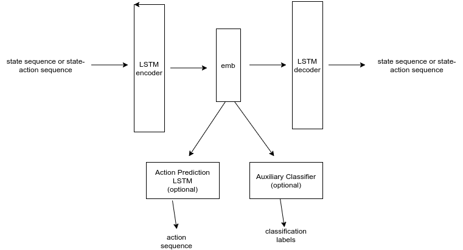
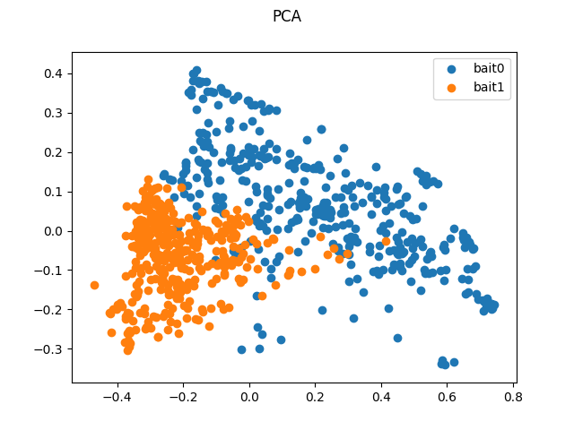
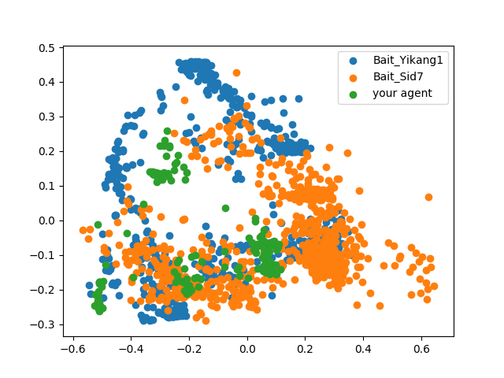

Policy Representation
===

Installation 
--

To use this repo, clone it inside the [Team-Space-Fortress](https://github.com/twni2016/Team-Space-Fortress).

From inside of the root directory, do a:

    pip install -e .
    
    
Method
--

Their are two methods that have been implemented here: 

1. Agent Classification: In this method, we use some recorded agent/human trajectories to learn a LSTM classifier to
predict agent/human idenity from unseen data. So, this can be used to train classification models for predicting 
bait or shooter identities.

2. Agent Autoencoder: In this method, we train an LSTM auto-encoder on agent/human trajectories. The generated 
embeddings can be used to measure distances of new agents/human to known agents/humans in the embedding space.
Shown below is the method used for generating policy representation.
    

Training your Own Models
---

You can avoid this part if you don't plan to train your own model and just want to use a pretrained
model that has been provided in the repo, for that just switch to the evaluation section.

Data Preparation for Training Your Own Models
---

Generating Self-Play Agent Trajectories
---

If you don't wish to generate your agent trajectories you can simply use the ones on ava at:

    /serverdata/sid/self_play_trajectories/

It has 1000 trajectories each bait-shooter pair.

To generate data from different agents use, the record_trajectories script in the 
[hat](https://github.com/twni2016/Team-Space-Fortress/tree/master/hat/self_play) directory.

Your files should be present in the following directory structure:
    
    --> < main rollout directory>
        --> <shooter_type>_Shooter<ind>_Bait_<bait_type><ind>
            --> bait_states.npy
            --> bait_actions.npy
            --> shooter_states.npy
            --> shooter_actions.npy
        

Running an Experiment
--

An example is given in run_experiments.py which does the following:

1. Prepares training and validation data for both agent classification and agent policy encoder.
2. Trains agent classifier and saves it training plots. 
3. Trains agent policy autoencoder for different conditions: Using auxiliary classifier, 
   using auxiliary action predictor etc. and saves relevent models and plots.
4. Runs the policy representation model on an example json file. 

Each of these components would be explained in the sections given below, the run_experiments.py 
is sufficient for running all the steps together.

Preparing Data for Training
--

After you have generated the trajectory data from 
   
If you want to generate data for baits use:

    python -m policy_representation.train_agent_classifier --load_baits --experiment_name 
    <name of the experiment> --rollout_path <main directory where different rollout subdir are>
    --generate_data --data_path <where to save trained model>
    --rollout_path <main rollout dir> 
    --plots_path <directory where training plots would be stored>
    --agents Turn_Only_Shooter5_Bait_Yikang0 Turn_Only_Shooter5_Bait_Sid7 ...)

This will save the following:

In your 
    
    --> <data_path>
        --> <experiment_name>
            --> X_train.npy
            --> y_train.npy
            --> X_test.npy
            --> y_test.npy
            --> agent_key.txt (which label corresponds to which agent)
        

In the agents option specify the name of the rollout subdirectories present in the 
rollout directory separated by space.

For generating shooter data the opt --load_baits should be omitted.
 
Agent Classifier
---
To train the agent classifier use the following command:
  
    python -m policy_representation.train_agent_classifier --train
    --agents <agent_dir1> <agent_dir 2> ....
    --model_path <where to save trained model> --rollout_dir <main rollout dir> 
    --plots_path <directory where training plots would be stored>
    --load_baits <use if model is for baits, don't use for shooter models>
    --num_agents <N class classification> --experiment_name <name of the experiment> 
    --epochs <num_epochs>

This will save the following:

    --> <data_path>
        --> <experimet_name>
            --> classifier.h5

    --> <plots_path>
        --> <experiment_name>
            --> acc_classifier.png
            --> loss_classifier.png

Policy Representation Autoencoder
---
To train the policy representation autoencoder use the following command.

    python -m policy_representation.train_autoencoder --experiment_name <name of the experiment> 
    --use_actions <use if actions are used as input as well, otherwise don't>
    --use_classifier <use this tag if auxiliary classifier is used, omit otherwise>
    --use_auxiliary_pred <use this tag if auxiliary action pred net is used, omit otherwise>
    --num_agents <number of different agents> 
    --epochs <num epochs> --train <use this if model is being trained and evaluated, omit when being
    only evaluated> 
    --data_path <main dir where your experiment directory containing X_train and X_test>
    --plots_path <directory where training plots would be stored>
    

This will save the following in your data_path:

    --> <data_path>
        --> <experiment_name>
            --> model_ae_<experiment_params>.hdf5 (weights of the autoencoder model)
            --> model_pca_<experiment_params>.pkl 
            --> model_pca_test_<experiment_params>.pkl (PCA on validation data set)
            --> pca_<experiment_params>_class_{i}.npy

In your plots directory the following will be saved:
    
    --> <plots_path>
        --> loss_<experiment_params>.png                   
        --> pca_<experiment_params>.png
        --> pca_test_<experiment_params>.png  (for validation data)

<experiment_params> is a string which specifies the choice of your model. For example, if you choose
to use actions as well in the input and an auxiliary agent classifier as well, the <experiment_params> would be _use_actions_use_classifier. This is helpful so that when you change
these conditions to something else the plots can be stored under the same experiment directory.

An example of the generated pca plot is shown below

Evaluation Using Pretrained Models
--

Offline Evaluation on a recorded Json 
---

    python -m policy_representation.encode_json --plots_path <directory where your generated plots will be stored>
    --data_path <directory where your experiment directory is there which stores your pretrained model>
    --use_actions (use this tag if the model you're using uses states and actions both as input)
    --num_agents <specify the number of agents that were used to train your pretrained model>
    --experiment_name <name of the experiment, the stored model should be inside this directory>
    --agent_id <id(0 or 1) of the agent in your json whose embeddings you wish to generate, make sure you 
    use the bait_id when using an embedding model for baits and the shooter_id when using the embedding model 
    for shooters> --embedding_generation_interval <after how many timesteps you wish to generate the embeddings,
    if not specified the whole trajectory is used to give one single embedding>
    --json_path <path to your json file>
    
This will create pca plots for your trajectories and display along with the training and validation data in:

    --> <plots_path>
        --> pca_json.png 
        --> pca_test_json.png

This kind of plot would be generated 

In the above figure, the subtrajectories(generated based on your specified embeddings_gen_interval) are plotted in
green along with the pca of the training trajectory embeddings. 

Please follow the script [json_example.py](https://github.com/gutsy-robot/policy_representation/blob/master/json_example.py) to follow step by step how to load and process json
and measure similarity with agent embeddings which were used to train the model.
   
Online Evaluation During Human-Agent Teaming
--

You can follow the documentation [here](https://github.com/twni2016/Team-Space-Fortress/tree/master/hat/agents) for this part.
